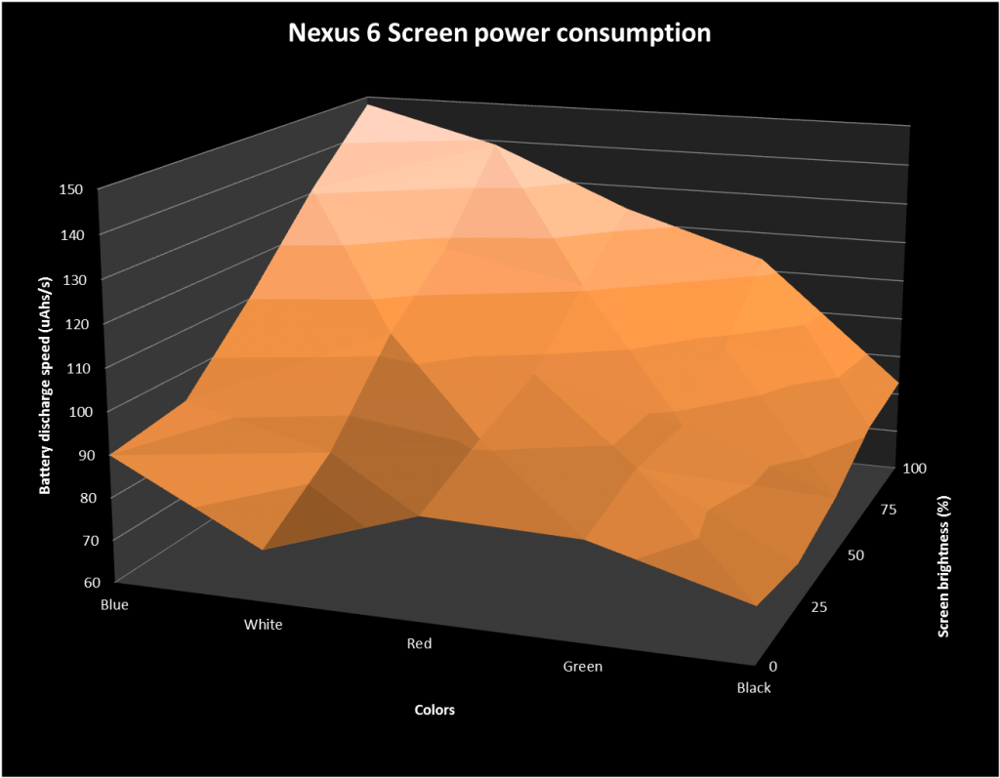

# Colours Usage

## Problem

Let's shed some light on the impact of pixel colors and screen types on power consumption, specifically focusing on AMOLED and LCD screens.

For AMOLED screens, the color rendered by a pixel directly affects power usage. In terms of power consumption hierarchy, the order from lowest to highest is as follows: Black < Green < Red < White < Blue. Moreover, the disparity in power consumption becomes more pronounced as the screen brightness increases. Consequently, incorporating a "dark mode" in your app can significantly reduce its power consumption on AMOLED screens.

*Consumption per color - source: [Greenspector][Greenspector]*

On the other hand, LCD screens employ color filters that are applied after rendering a white pixel. As a result, the impact of color variations on power consumption is relatively less significant compared to AMOLED screens.

By understanding these nuances and considering the specific screen technology used in mobile devices, you can make informed design choices to optimise power consumption and promote energy efficiency in your app. Embracing features like "dark mode" can not only enhance user experience but also contribute to reducing the environmental footprint associated with mobile app usage.

## Measure

For this measure, we will take into account:

- the presence of a dark mode

- the colours used by the theme (especially background colour)

### Grading

- A: your app has a single dark theme or two possible modes (dark/light)
- D: your app has a single theme that is not dark

**Weight in the final calculation** : 3

## Other information

### What solution to increase my grade ?

- Try to provide a dark mode in addition to your light mode

- When using a light mode, focus on colours based on their consumption (Black < Green < Red < White < Blue)

### Sources

- [https://www.xda-developers.com/google-wants-developers-to-add-dark-themes-to-save-battery-life/](https://www.xda-developers.com/google-wants-developers-to-add-dark-themes-to-save-battery-life/)
- [GreenSpector]: (https://greenspector.com/en/should-you-switch-your-wallpaper-to-affect-less-the-battery-life-of-your-smartphone/)
