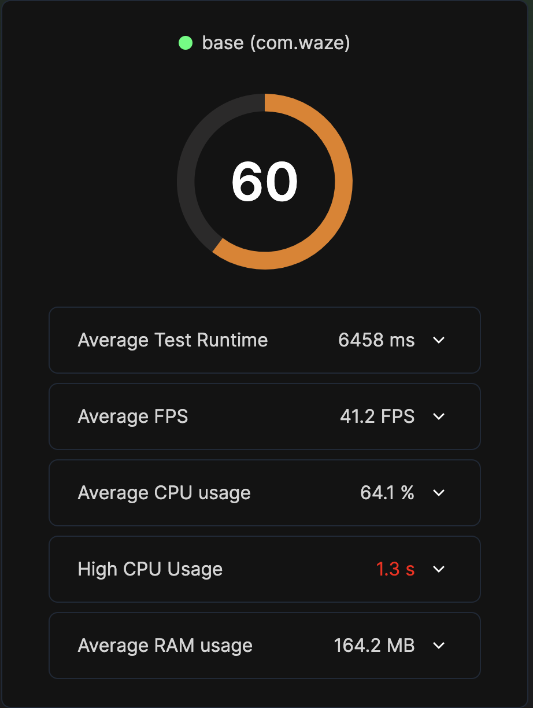
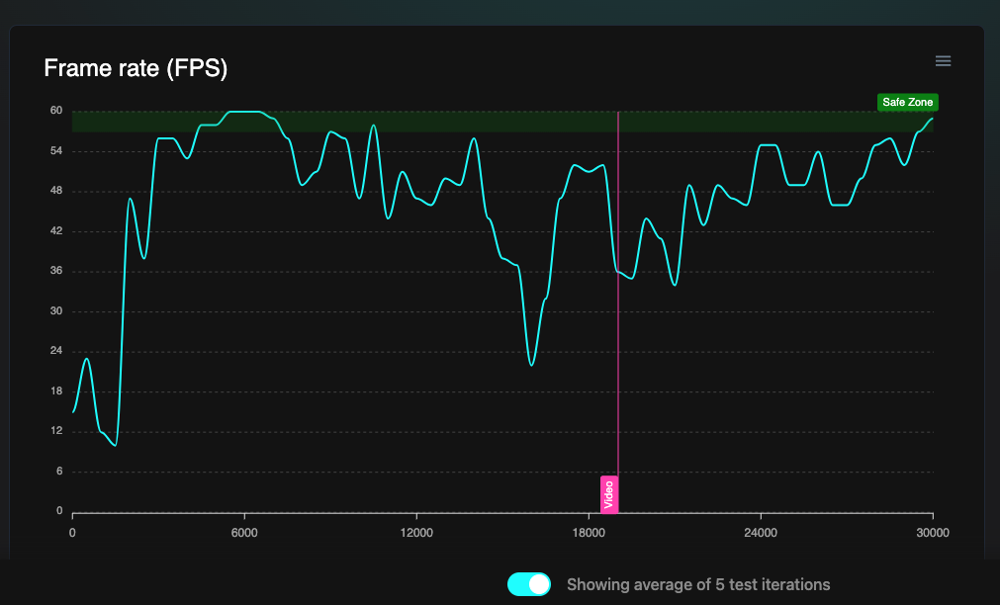
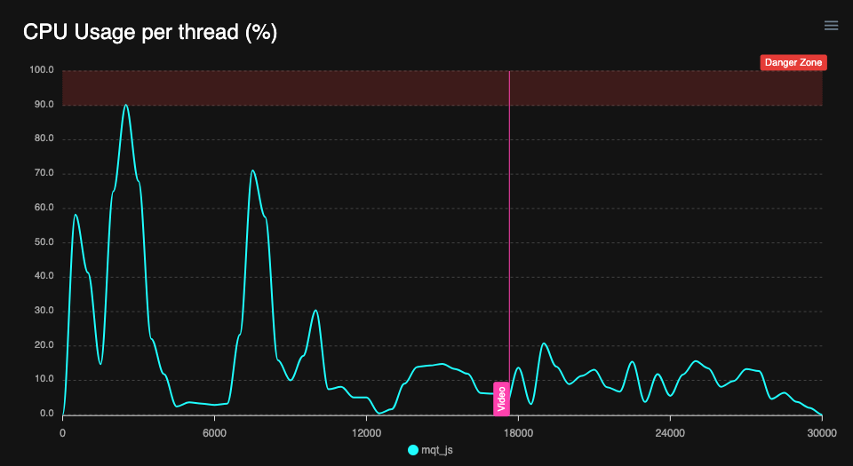
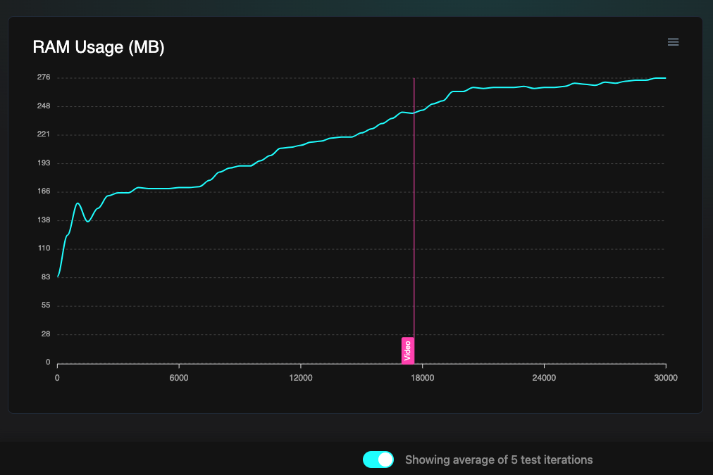

# Flashlight score

## Problem

The performance of an application can be measured through multiple metrics such as:

- Average FPS: The application needs to generate a sufficient number of frames per second (FPS) in order to have a pleasant user experience. If there are too few FPS, the application may "freeze" visually. Your app should display close to 60 Frames Per Second to give an impression of fluidity.
- Average CPU usage: An application might run at 60FPS but might be using too much processing power, so it's important to check CPU usage.
  Depending on the device, this value can go up to 100% x number of cores.
- High CPU usage time: High CPU usage by a single process can cause app unresponsiveness, even with low overall CPU usage. For instance, an overworked JS thread in a React Native app may lead to unresponsiveness despite maintaining 60 FPS.
- Average RAM usage: If an app consumes a large amount of RAM (random-access memory), it can impact the overall performance of the device and drain the battery more quickly.
- Time to interact: The longer the boot time, the more it is representative of an intense CPU load. This can impact the processor degradation (as well as the power consumption).

Measuring all of them manually can be difficult and lead to false or imprecise results. Flashlight can solve this issue by running automated tests, measure and write a report with the results of the tests.

A bad score is the reflection of bad performances. The worst a score is, the more the user will find painful to use the application possibly because of:

- Long time to boot
- Lags
- High power consumption
- Processor degradation

All these reasons might lead the user to change his phone because he doesn't find it performing well.

## Measure

For this measure, we will use Flashlight, an open source project developed by [BAM.tech](https://www.bam.tech/). We follow the steps written [here](https://docs.flashlight.dev/) to measure in live the performance of the app or [here](https://docs.flashlight.dev/test/getting-started) if we want to automatise some tests. We can even use [the cloud version](https://docs.flashlight.dev/cloud/intro).

#### iOS

For the moment, Flashlight is not available on iOS.

### Grading

- A: The score is ≥90
- B: The score is ≥80
- C: The score is ≥70
- D: The score is <70

**Weighting in the total calculation** : 3

### Flashlight report output 

Example of score computed by Flashlight on an app:

Detail for each metric given by flashlight:

### Sources

- [Flashlight, an open source project](https://github.com/bamlab/flashlight)
- Article: [How to measure React Native performance with Flashlight](https://www.bam.tech/article/measuring-react-native-performance-with-flashlight)