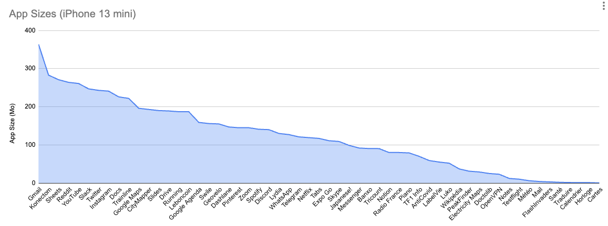

# App's size

## Problem

The limitation of phone storage has emerged as a significant concern for smartphone owners. In today's digital age, it has become increasingly challenging to accommodate all our favorite apps on our devices. This dilemma often forces users to make difficult choices, such as deleting apps or even considering the need to replace their phone altogether.

Historically, the addition of a micro SD card slot provided a solution to expand storage capacity. However, with advancements in recent years, we have witnessed a decline in the presence of micro SD ports on smartphones. As a result, users now have fewer opportunities to enhance their device's storage capabilities.

Recognising the impact this issue has on user experience and the environment, it is crucial for manufacturers and designers to address storage limitations effectively. Developing innovative solutions, such as optimising app sizes and exploring alternative storage options, can alleviate the strain on phone owners and reduce the need for drastic measures like changing devices.

By proactively considering storage constraints during the app development process and advocating for devices that offer flexible storage options, we can enhance user satisfaction and contribute to a more sustainable approach to smartphone usage.

### Case study

On a sample iPhone 13 mini, every app installed ranked by size: 

*October 2022*

## Measure

For this measure, we will use both an android and an iOS devices.

### iOS

Try to use a device that "renders at 2x" such as an iPhone SE. You can see the guide [here](https://www.paintcodeapp.com/news/ultimate-guide-to-iphone-resolutions)

Then go to Parameters > General > Stockage > Choose your app > Size

### Android

Use a Samsung J3.

Hold application icon > Info button > Storage > App's size

### Grading

Compute the average between iOS and Android size, then then following the scale below you can set the grade of this indicator.

- A: < 50 Mb your app is small and optimized
- B: < 100 Mb your app is large
- C: < 150 Mb your app is very large app
- D: > 150 Mb your app is too large

**Weighting in the total calculation** : 2

## Other information

The download limit for an app without a wifi connexion used to be 150Mb, it was recently raised to 200Mb.

