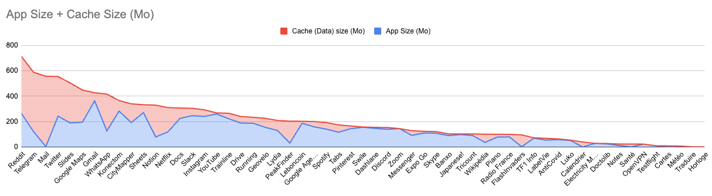

# Documents and data

## Problem

Beyond the size of the app itself, the accumulation of documents and cached data by an app on a user's phone can swiftly consume valuable memory space, often without the user having full control over it. As the memory becomes saturated, users are often left with no other choice but to contemplate switching to a new device.

This issue highlights the significance of efficient data management within mobile applications. By implementing strategies that prioritise responsible data storage, retrieval, and caching, we can mitigate the impact of app-related memory usage on user devices.

Enabling users to have greater control over the data stored by the app, such as offering options to clear caches or manage stored documents, empowers them to make informed decisions and optimise memory usage. Additionally, adopting efficient data handling practices within the app can minimise unnecessary memory consumption, alleviating the need for users to resort to device replacement.

### Case study

On a sample iPhone 13 mini, every app installed ranked by their app+cache size: 

*October 2022*

## Measure

For this measure, we will use Android only. iOS data is not relevant as it doesn't show all the data stored for an app (for example Whatsapp's photos are hidden behind "Other" data)

### Android

Use a Samsung J3.

Hold application icon > Info button > Storage > Delete Data and Clear Cache

Use the app for 10 minutes straight and try to use as many features as possible. Then you can go back to your app's information and add up the sum of both generated data and cache.

### Grading

Follow the scale below:

- A: < 10 Mb your app is small and does not use cache
- B: < 30 Mb your app does not use a lot of cache
- C: < 100 Mb your app uses the cache but with light data
- D: > 100 Mb your app uses the cache with large data

**Weighting in the total calculation** : 3

## Other information

This indicator shows that you must care about what you store in cache! Try to clean as much useless info as possible.
