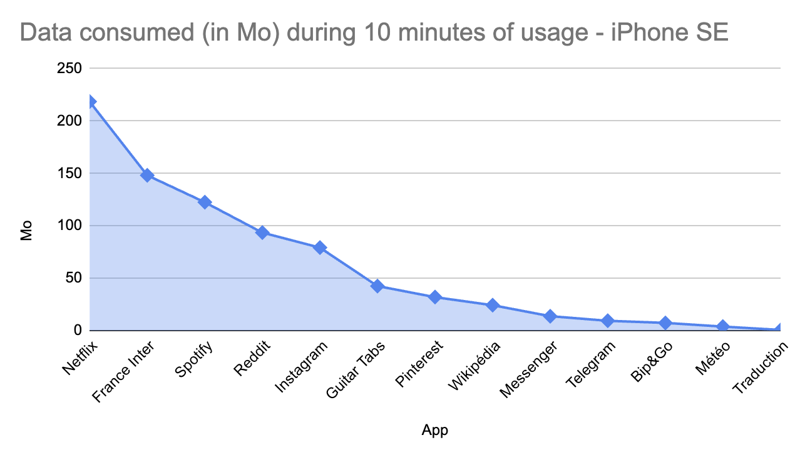

# Network data

## Problem

The number of requests, be it HTTP or SQL, required for an app to function plays a vital role in determining its physical resource requirements. This technical indicator provides valuable insights into the impact of the software layer on the underlying physical infrastructure.

To minimise the environmental footprint associated with the app's operation, it is crucial to focus on reducing the number of requests per page. By doing so, we can effectively reduce the need for multiple HTTP servers to run the app, subsequently mitigating the environmental impacts linked to their operation.

Optimising the app's architecture and implementing efficient data retrieval and transmission techniques can help streamline the number of requests, resulting in a leaner and more environmentally friendly app infrastructure.

### Case study

On a sample iPhone SE, 13 apps ranked by their network data consumption size: 

*March 2021*

## Measure

For this measure, we will use both iOS and Android devices.

### iOS

- In Settings > Cellular Data reset the statistics of consumed data
- Turn off the Wi-Fi
- Use the app for about 10 minutes (time yourself by going through the features; if it takes less than 10 minutes, normalize the result later)
- In Settings > Cellular data, watch the volume of data consumed

### Android

- Uninstall the app and reinstall it
- Turn off the Wi-Fi
- Use the app for about 10 minutes
- Hold down the app button > Mobile data and Wi-Fi, note total

### Grading

- A: < 25 Mb, messaging type without video calls, weather, translation
- B: < 50 Mb, image search type such as Pinterest
- C: < 100 Mb, social network type such as instagram
- D: > 100 Mb, video or streaming service type

**Weight in the final calculation** : 3

## Other information

### Sources

- [Bonne pratique n°9](https://collectif.greenit.fr/ecoconception-web/115-bonnes-pratiques-eco-conception_web.html)
